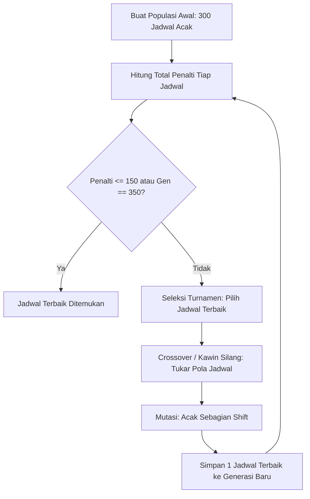

# Optimasi Penjadwalan Shift Kerja Apotek 24 Jam (K-24) Menggunakan Algoritma Genetika

Program ini menggunakan **Algoritma Genetika** untuk membuat jadwal shift kerja karyawan apotek 24 jam (Senin – Minggu) secara otomatis.

Mendukung **5 sampai 8 staf** dan dilengkapi fitur **shift lembur** (staf pagi lanjut ke shift Middle atau Siang) agar kuota harian selalu terpenuhi tanpa melanggar batasan hari kerja.

Dibuat menggunakan Python dengan library [DEAP](https://github.com/DEAP/deap) dan [NumPy](https://numpy.org/).

---

## 1. Cara Kerja Algoritma Genetika

Proses pencarian jadwal terbaik dilakukan melalui siklus evolusi:



### Parameter yang Digunakan
- **Panjang Genom**: `Jumlah Staf` × 7 Hari (misal 5 staf = 35 gen, 6 staf = 42 gen).
- **Nilai Gen**: Kode shift 0 sampai 6:
  - `0`: Libur (*Off*)
  - `1`: Pagi (07.00 - 15.00)
  - `2`: Middle / MD (11.00 - 19.00)
  - `3`: Siang (14.00 - 22.00)
  - `4`: Malam (22.00 - 07.00)
  - `5`: Lembur Pagi-MD (07.00 - 19.00)
  - `6`: Lembur Pagi-Siang (07.00 - 22.00)
- **Ukuran Populasi**: 300 jadwal per generasi.
- **Maksimal Generasi**: 350 generasi (otomatis berhenti jika jadwal optimal sudah ditemukan).
- **Seleksi**: *Tournament Selection* (ukuran turnamen = 4).
- **Crossover**: *Two-Point Crossover* (peluang 85%).
- **Mutasi**: *Uniform Integer Mutation* (peluang 35%).
- **Elitisme**: Menyimpan 1 jadwal terbaik agar kualitas solusi tidak menurun.

---

## 2. Struktur Direktori

```text
tugas GA/
├── .venv/                   # Virtual environment Python
├── requirements.txt         # Daftar paket library (numpy, deap)
├── optimasi_shift_k24.py    # Program utama Algoritma Genetika
└── README.md                # Dokumentasi proyek
```

---

## 3. Panduan Menjalankan Program

### A. Aktifkan Virtual Environment
```bash
source .venv/bin/activate
```

### B. Install Library yang Dibutuhkan
```bash
pip install -r requirements.txt
```

### C. Jalankan Program
```bash
python optimasi_shift_k24.py
```

---

## 4. Contoh Hasil Jadwal (5 Staf)

Ketika dijalankan dengan **5 staf**, program berhasil mengisi kuota malam 2 orang setiap hari dan memastikan seluruh karyawan mendapat hak libur (tidak bekerja lebih dari 6 hari):

```text
======================================================================
JADWAL KERJA K-24 (5 Staf | Total Penalti: 235)
======================================================================
Staf        Sen   Sel   Rab   Kam   Jum   Sab   Min  | Total Hari Kerja
----------------------------------------------------------------------
Karyawan 1  Pagi  Off   MD    Sian  PgMD  PgSi  PgMD  | 6 hari (Off: 1)
Karyawan 2  Mlm   Sian  Mlm   Mlm   Sian  MD    Off   | 6 hari (Off: 1)
Karyawan 3  MD    Mlm   Mlm   Off   Mlm   Mlm   Sian  | 6 hari (Off: 1)
Karyawan 4  Mlm   Mlm   Sian  Mlm   Mlm   Off   Mlm   | 6 hari (Off: 1)
Karyawan 5  Sian  PgMD  Pagi  PgMD  Off   Mlm   Mlm   | 6 hari (Off: 1)

Rekap Kuota Harian & Penggunaan Lembur:
Sen: Pagi=1/1 | MD=1/1 | Siang=1/1 | Malam=2/2
Sel: Pagi=1/1 | MD=1/1 | Siang=1/1 | Malam=2/2 (Lembur: 1)
Rab: Pagi=1/1 | MD=1/1 | Siang=1/1 | Malam=2/2
Kam: Pagi=1/1 | MD=1/1 | Siang=1/1 | Malam=2/2 (Lembur: 1)
Jum: Pagi=1/1 | MD=1/1 | Siang=1/1 | Malam=2/2 (Lembur: 1)
Sab: Pagi=1/1 | MD=1/1 | Siang=1/1 | Malam=2/2 (Lembur: 1)
Min: Pagi=1/1 | MD=1/1 | Siang=1/1 | Malam=2/2 (Lembur: 1)
----------------------------------------------------------------------
[v] STATUS: SEMUA KUOTA HARIAN TERPENUHI 100%! (Shift malam selalu 2 orang)

======================================================================
RINCIAN LENGKAP KOMPONEN PENALTI (Total Skor: 235)
======================================================================
1. Kuota Shift Malam (Wajib Selalu 2 Orang):
   [v] Terpenuhi 100% (Semua hari terisi 2 staf malam)

2. Batasan Hari Kerja (Maksimal 6 Hari / Wajib Libur >= 1 Hari):
   [v] Terpenuhi 100% (Tidak ada karyawan bekerja > 6 hari)

3. Kuota Shift Lain (Pagi, MD, Siang):
   [v] Terpenuhi 100% (Pagi, MD, Siang terpenuhi setiap hari)

4. Penggunaan Shift Lembur (Subtotal: +75):
   - Karyawan 1 (Jumat): Ambil lembur PgMD (+15)
   - Karyawan 1 (Sabtu): Ambil lembur PgSi (+15)
   - Karyawan 1 (Minggu): Ambil lembur PgMD (+15)
   - Karyawan 5 (Selasa): Ambil lembur PgMD (+15)
   - Karyawan 5 (Kamis): Ambil lembur PgMD (+15)

5. Lembur Berturut-turut (Subtotal: +160):
   - Karyawan 1 (Jumat -> Sabtu): Lembur beruntun PgMD -> PgSi (+80)
   - Karyawan 1 (Sabtu -> Minggu): Lembur beruntun PgSi -> PgMD (+80)

6. Pelanggaran Transisi Terlarang Pasca-Malam:
   (Tidak ada pelanggaran transisi)

7. Shift Malam Berturut-turut > 2 Malam (Subtotal: +0):
   (Tidak ada staf dinas malam > 2 malam berturut-turut)
======================================================================
```

---

## 5. Aturan & Bobot Penalti

Sistem menghitung penalti untuk menentukan jadwal terbaik (semakin kecil penalti, semakin baik jadwalnya):

1. **Shift Malam Kurang dari 2 Orang**: +4000 per kekurangan orang *(Aturan mutlak demi keamanan unit 24 jam)*.
2. **Bekerja Lebih dari 6 Hari Seminggu**: +4000 per staf *(Aturan mutlak: staf wajib libur minimal 1 hari)*.
3. **Shift Lain Kosong (Pagi, MD, Siang)**: +1500 per kekurangan orang.
4. **Jeda Istirahat Terlalu Singkat Setelah Shift Malam**:
   - Malam langsung lanjut Pagi/Lembur: +2500 *(bentrok jam kerja)*.
   - Malam lanjut MD: +2000 *(waktu istirahat hanya 4 jam)*.
5. **Biaya Lembur**: +15 per shift lembur *(agar lembur hanya dipakai jika jumlah staf minim)*.
6. **Lembur 2 Hari Berturut-turut**: +80 *(mencegah staf kelelahan)*.
7. **Shift Malam Lebih dari 2 Hari Berturut-turut**: +250 per malam berikutnya.
8. **Kelebihan Hari Libur**: +50 jika staf libur lebih dari 3 hari seminggu.
9. **Transisi Shift Siang ke Pagi**: 0 penalti *(sah dan normal sesuai SOP K-24)*.
