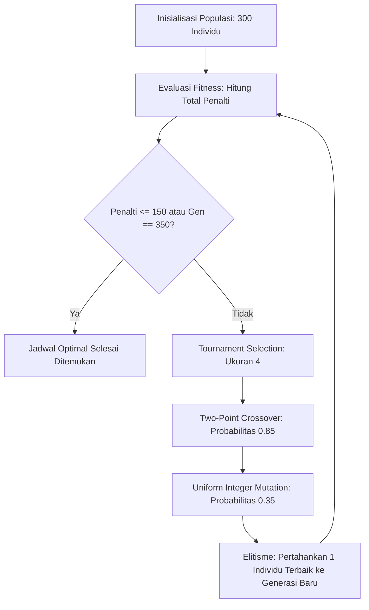

# Optimasi Penjadwalan Shift Kerja Apotek 24 Jam (K-24) Menggunakan Algoritma Genetika

Proyek ini mengimplementasikan **Algoritma Genetika (Genetic Algorithm)** untuk menyelesaikan permasalahan penjadwalan shift karyawan (*Staff Rostering Problem*) pada apotek atau unit ritel yang beroperasi 24 jam sehari selama 7 hari seminggu (Senin – Minggu).

Model ini mendukung penjadwalan fleksibel dari **5 hingga 8 staf** serta dilengkapi dengan **aturan shift lembur (*overtime*)**, di mana staf shift pagi dapat menyambung lembur ke jam MD (*Middle*) atau shift Siang untuk memastikan seluruh kuota operasional terpenuhi tanpa melanggar batasan kerja.

Implementasi ini dibangun menggunakan pustaka [DEAP (Distributed Evolutionary Algorithms in Python)](https://github.com/DEAP/deap) dan [NumPy](https://numpy.org/).

---

## 1. Latar Belakang & Masalah yang Dioptimasi

### A. Tantangan Penjadwalan Manual
Penjadwalan shift kerja pada unit 24 jam adalah masalah optimasi kombinatorial yang tergolong **NP-Hard**. 
Dengan:
- **5 s.d. 8 staf**
- **7 hari kerja** (Senin s.d. Minggu)
- **7 opsi status shift** per hari:
  - `0`: Libur (*Off*)
  - `1`: Shift Pagi (07.00 - 15.00)
  - `2`: Shift Middle / MD (11.00 - 19.00)
  - `3`: Shift Siang (14.00 - 22.00)
  - `4`: Shift Malam (22.00 - 07.00)
  - `5`: **Lembur Pagi-MD (PgMD)** (07.00 - 19.00) — Staf pagi lembur menyambung hingga jam MD
  - `6`: **Lembur Pagi-Siang (PgSi)** (07.00 - 22.00) — Staf pagi *double shift* menyambung hingga jam Siang

Ruang pencarian kombinasi jadwal sangat masif (untuk 5 staf: $7^{35} \approx 3,79 \times 10^{29}$ kemungkinan; untuk 8 staf: $7^{56} \approx 3,74 \times 10^{47}$ kemungkinan).

### B. Mengapa Diperlukan Aturan Lembur pada Tim Ramping (5–6 Staf)?
- **Kebutuhan Shift Mingguan**: Setiap hari membutuhkan minimal Pagi 1, MD 1, Siang 1, dan Malam 2 (= 5 shift/hari). Total kebutuhan adalah **35 shift seminggu**.
- **Batasan Kerja Maksimal 6 Hari**: Jika ada 5 staf dan **tidak boleh ada yang bekerja > 6 hari**, maka kapasitas kerja maksimal yang tersedia adalah $5 \times 6 = \mathbf{30\text{ hari kerja}}$.
- **Defisit Kapasitas**: Terdapat defisit $35 - 30 = \mathbf{5\text{ shift}}$.
- **Solusi Lembur**: Shift lembur (`PgMD` dan `PgSi`) mengisi 2 kuota sekaligus dalam 1 hari kerja. Dengan minimal 5 shift lembur yang terdistribusi adil, 5 staf dapat menutupi kebutuhan 35 shift secara sempurna tanpa melanggar hak libur karyawan.

---

## 2. Batasan & Kendala Operasional (*Constraints*)

Sistem mengelompokkan aturan operasional ke dalam sistem penalti berbobot (*weighted penalties*):

### A. Hard Constraints (Batasan Mutlak Operasional)
Pelanggaran batasan ini dikenakan penalti sangat besar ($>1500$) sehingga algoritma dipaksa memenuhinya 100%:
1. **Shift Malam WAJIB SELALU 2 Orang**: Demi keamanan dan operasional 24 jam, setiap hari (Senin s.d. Minggu) shift malam tidak boleh kurang dari 2 staf (Penalti: $+4000 \times \text{kekurangan staf}$).
2. **Dilarang Bekerja > 6 Hari Seminggu**: Setiap staf maksimal bekerja 6 hari dalam sepekan (wajib memiliki minimal 1 hari libur/Off) (Penalti: $+4000$ jika bekerja 7 hari nonstop).
3. **Kuota Shift Lain**: Minimal 1 staf per hari untuk Pagi (diisi `1`, `5`, `6`), MD (diisi `2`, `5`), dan Siang (diisi `3`, `6`) (Penalti: $+1500 \times \text{kekurangan staf}$).
4. **Larangan Tabrakan Fisik Pasca-Shift Malam (Shift 4)**:
   - **Malam $\to$ Pagi / Lembur (`1`, `5`, `6`)**: Pulang jam 07.00 langsung masuk jam 07.00 adalah tabrakan fisik langsung (Penalti: $+2500$).
   - **Malam $\to$ MD (`2`)**: Pulang jam 07.00 masuk jam 11.00 hanya menyisakan jeda 4 jam (Penalti: $+2000$).
   - *Pilihan sah setelah Shift Malam hanyalah: Libur (`0`), Siang (`3`, jeda 7 jam), atau lanjut Shift Malam (`4`)*.

### B. Soft Constraints (Ergonomi, Lembur, & Beban Kerja)
1. **Preferensi Penalti Lembur**: Diberikan penalti ringan ($+15$ per shift lembur) agar algoritma mengutamakan jadwal reguler dan hanya mengambil opsi lembur jika kondisi staf mendesak.
2. **Larangan Lembur Beruntun**: Jika staf mengambil lembur 2 hari berturut-turut, diberikan penalti $+80$ untuk mencegah kelelahan berlebih.
3. **Transisi Siang $\to$ Pagi / Lembur (SOP K-24)**: Pulang jam 22.00 dan masuk jam 07.00 keesokan harinya adalah transisi yang **wajar dan sah dalam SOP K-24** ($0$ penalti).
4. **Batas Shift Malam Beruntun**: Maksimal 2 malam berturut-turut untuk menjaga ritme sirkadian staf (Penalti: $+250$ per malam tambahan).
5. **Keseimbangan Hari Libur**: Maksimal 3 hari libur seminggu untuk mencegah timpang beban kerja ke staf lain (Penalti: $+50$ per kelebihan hari libur).

---

## 3. Solusi dengan Algoritma Genetika

Algoritma Genetika mengoptimasi jadwal melalui siklus evolusi:



### Parameter & Operator Genetika
- **Panjang Genom**: $\text{NUM\_STAFF} \times \text{DAYS}$ (misal $5 \times 7 = 35$ gen).
- **Nilai Gen**: Integer $0..6$.
- **Ukuran Populasi**: 300 individu.
- **Maksimal Generasi**: 350 generasi (dengan *early stopping* jika semua *hard constraints* lolos).
- **Seleksi**: *Tournament Selection* (ukuran turnamen = 4).
- **Crossover**: *Two-Point Crossover* ($P_c = 0.85$).
- **Mutasi**: *Uniform Integer Mutation* ($P_m = 0.35$, $indpb = 0.05$).
- **Elitisme**: *Hall of Fame* (ukuran 1) menjamin solusi terbaik tidak pernah terdegradasi.

---

## 4. Struktur Direktori

```text
tugas GA/
├── .venv/                   # Virtual environment Python
├── requirements.txt         # Daftar dependensi PIP (numpy, deap)
├── optimasi_shift_k24.py    # Skrip utama Algoritma Genetika
└── README.md                # Dokumentasi sistem & pemodelan
```

---

## 5. Panduan Instalasi & Eksekusi

### A. Aktivasi Virtual Environment
```bash
source .venv/bin/activate
```

### B. Instalasi Dependensi
```bash
pip install -r requirements.txt
```

### C. Menjalankan Skrip
```bash
python optimasi_shift_k24.py
```

---

## 6. Contoh Output Eksekusi (Konfigurasi 5 Staf)

Ketika dijalankan dengan konfigurasi **5 staf**, algoritma berhasil mengunci kuota malam 2 orang setiap hari dan memastikan tidak ada karyawan bekerja $>6$ hari:

```text
======================================================================
JADWAL KERJA K-24 (5 Staf | Total Penalti: 235)
======================================================================
Staf        Sen   Sel   Rab   Kam   Jum   Sab   Min  | Total Hari Kerja
----------------------------------------------------------------------
Karyawan 1  Pagi  Off   MD    Sian  PgMD  PgSi  PgMD  | 6 hari (Off: 1)
Karyawan 2  Mlm   Sian  Mlm   Mlm   Sian  MD    Off   | 6 hari (Off: 1)
Karyawan 3  MD    Mlm   Mlm   Off   Mlm   Mlm   Sian  | 6 hari (Off: 1)
Karyawan 4  Mlm   Mlm   Sian  Mlm   Mlm   Off   Mlm   | 6 hari (Off: 1)
Karyawan 5  Sian  PgMD  Pagi  PgMD  Off   Mlm   Mlm   | 6 hari (Off: 1)

Rekap Kuota Harian & Penggunaan Lembur:
Sen: Pagi=1/1 | MD=1/1 | Siang=1/1 | Malam=2/2
Sel: Pagi=1/1 | MD=1/1 | Siang=1/1 | Malam=2/2 (Lembur: 1)
Rab: Pagi=1/1 | MD=1/1 | Siang=1/1 | Malam=2/2
Kam: Pagi=1/1 | MD=1/1 | Siang=1/1 | Malam=2/2 (Lembur: 1)
Jum: Pagi=1/1 | MD=1/1 | Siang=1/1 | Malam=2/2 (Lembur: 1)
Sab: Pagi=1/1 | MD=1/1 | Siang=1/1 | Malam=2/2 (Lembur: 1)
Min: Pagi=1/1 | MD=1/1 | Siang=1/1 | Malam=2/2 (Lembur: 1)
----------------------------------------------------------------------
[v] STATUS: SEMUA KUOTA HARIAN TERPENUHI 100%! (Shift malam selalu 2 orang)

======================================================================
RINCIAN LENGKAP KOMPONEN PENALTI (Total Skor: 235)
======================================================================
1. Kuota Shift Malam (Wajib Selalu 2 Orang):
   [v] Terpenuhi 100% (Semua hari terisi 2 staf malam)

2. Batasan Hari Kerja (Maksimal 6 Hari / Wajib Libur >= 1 Hari):
   [v] Terpenuhi 100% (Tidak ada karyawan bekerja > 6 hari)

3. Kuota Shift Lain (Pagi, MD, Siang):
   [v] Terpenuhi 100% (Pagi, MD, Siang terpenuhi setiap hari)

4. Penggunaan Shift Lembur (Subtotal: +75):
   - Karyawan 1 (Jumat): Ambil lembur PgMD (+15)
   - Karyawan 1 (Sabtu): Ambil lembur PgSi (+15)
   - Karyawan 1 (Minggu): Ambil lembur PgMD (+15)
   - Karyawan 5 (Selasa): Ambil lembur PgMD (+15)
   - Karyawan 5 (Kamis): Ambil lembur PgMD (+15)

5. Lembur Berturut-turut (Subtotal: +160):
   - Karyawan 1 (Jumat -> Sabtu): Lembur beruntun PgMD -> PgSi (+80)
   - Karyawan 1 (Sabtu -> Minggu): Lembur beruntun PgSi -> PgMD (+80)

6. Pelanggaran Transisi Terlarang Pasca-Malam:
   (Tidak ada pelanggaran transisi)

7. Shift Malam Berturut-turut > 2 Malam (Subtotal: +0):
   (Tidak ada staf dinas malam > 2 malam berturut-turut)
======================================================================
```

---

### Transparansi Rincian Komponen Penalti
Skrip dilengkapi dengan fitur audit rincian skor (*penalty breakdown*) di akhir eksekusi, sehingga setiap komponen penalti dapat diaudit secara gamblang:
1. **Kekurangan Shift Malam**: $+4000$ per kekurangan staf (*Hard Constraint* mutlak).
2. **Bekerja 7 Hari Nonstop**: $+4000$ per karyawan (*Hard Constraint* mutlak: dilarang kerja $>6$ hari).
3. **Kekurangan Shift Lain (Pagi, MD, Siang)**: $+1500$ per kekurangan staf.
4. **Tabrakan Fisik Pasca-Malam**: $+2500$ (Malam $\to$ Pagi/Lembur) dan $+2000$ (Malam $\to$ MD).
5. **Biaya Lembur**: $+15$ per shift lembur (`PgMD` / `PgSi`).
6. **Lembur Beruntun**: $+80$ jika staf lembur 2 hari berturut-turut.
7. **Shift Malam Beruntun**: $+250$ untuk malam ke-3 dan seterusnya tanpa jeda.
8. **Kelebihan Hari Libur**: $+50$ per kelebihan hari libur (>3 hari).
9. **Transisi Siang $\to$ Pagi**: $0$ penalti (sah dan wajar menurut SOP K-24).
