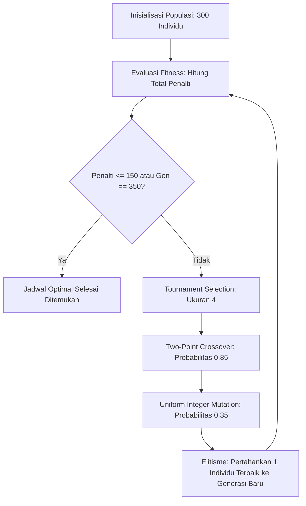

# Optimasi Penjadwalan Shift Kerja Apotek 24 Jam (K-24) Menggunakan Algoritma Genetika

Proyek ini mengimplementasikan **Algoritma Genetika (Genetic Algorithm)** untuk menyelesaikan permasalahan penjadwalan shift karyawan (*Staff Rostering Problem*) pada apotek atau unit ritel yang beroperasi 24 jam sehari selama 7 hari seminggu (Senin – Minggu).

Model ini mendukung penjadwalan fleksibel dari **5 hingga 8 staf** serta dilengkapi dengan **aturan shift lembur (*overtime*)**, di mana staf shift pagi dapat menyambung lembur ke jam MD (*Middle*) atau shift Siang untuk memastikan seluruh kuota operasional terpenuhi tanpa melanggar batasan kerja.

Implementasi ini dibangun menggunakan pustaka [DEAP (Distributed Evolutionary Algorithms in Python)](https://github.com/DEAP/deap) dan [NumPy](https://numpy.org/).

---

## 1. Solusi dengan Algoritma Genetika

Algoritma Genetika mengoptimasi jadwal melalui siklus evolusi:



### Parameter & Operator Genetika
- **Panjang Genom**: `NUM_STAFF` × `DAYS` (misal $6 \times 7 = 42$ gen atau $5 \times 7 = 35$ gen).
- **Nilai Gen**: Integer $0..6$.
- **Ukuran Populasi**: 300 individu.
- **Maksimal Generasi**: 350 generasi (dengan *early stopping* jika semua *hard constraints* lolos).
- **Seleksi**: *Tournament Selection* (ukuran turnamen = 4).
- **Crossover**: *Two-Point Crossover* ($P_c = 0.85$).
- **Mutasi**: *Uniform Integer Mutation* ($P_m = 0.35$, $indpb = 0.05$).
- **Elitisme**: *Hall of Fame* (ukuran 1) menjamin solusi terbaik tidak pernah terdegradasi.

---

## 2. Struktur Direktori

```text
tugas GA/
├── .venv/                   # Virtual environment Python
├── requirements.txt         # Daftar dependensi PIP (numpy, deap)
├── optimasi_shift_k24.py    # Skrip utama Algoritma Genetika
└── README.md                # Dokumentasi sistem & pemodelan
```

---

## 3. Panduan Instalasi & Eksekusi

### A. Aktivasi Virtual Environment
```bash
source .venv/bin/activate
```

### B. Instalasi Dependensi
```bash
pip install -r requirements.txt
```

### C. Menjalankan Skrip
```bash
python optimasi_shift_k24.py
```

---

## 4. Contoh Output Eksekusi (Konfigurasi 5 Staf)

Ketika dijalankan dengan konfigurasi **5 staf**, algoritma berhasil mengunci kuota malam 2 orang setiap hari dan memastikan tidak ada karyawan bekerja $>6$ hari:

```text
======================================================================
JADWAL KERJA K-24 (5 Staf | Total Penalti: 235)
======================================================================
Staf        Sen   Sel   Rab   Kam   Jum   Sab   Min  | Total Hari Kerja
----------------------------------------------------------------------
Karyawan 1  Pagi  Off   MD    Sian  PgMD  PgSi  PgMD  | 6 hari (Off: 1)
Karyawan 2  Mlm   Sian  Mlm   Mlm   Sian  MD    Off   | 6 hari (Off: 1)
Karyawan 3  MD    Mlm   Mlm   Off   Mlm   Mlm   Sian  | 6 hari (Off: 1)
Karyawan 4  Mlm   Mlm   Sian  Mlm   Mlm   Off   Mlm   | 6 hari (Off: 1)
Karyawan 5  Sian  PgMD  Pagi  PgMD  Off   Mlm   Mlm   | 6 hari (Off: 1)

Rekap Kuota Harian & Penggunaan Lembur:
Sen: Pagi=1/1 | MD=1/1 | Siang=1/1 | Malam=2/2
Sel: Pagi=1/1 | MD=1/1 | Siang=1/1 | Malam=2/2 (Lembur: 1)
Rab: Pagi=1/1 | MD=1/1 | Siang=1/1 | Malam=2/2
Kam: Pagi=1/1 | MD=1/1 | Siang=1/1 | Malam=2/2 (Lembur: 1)
Jum: Pagi=1/1 | MD=1/1 | Siang=1/1 | Malam=2/2 (Lembur: 1)
Sab: Pagi=1/1 | MD=1/1 | Siang=1/1 | Malam=2/2 (Lembur: 1)
Min: Pagi=1/1 | MD=1/1 | Siang=1/1 | Malam=2/2 (Lembur: 1)
----------------------------------------------------------------------
[v] STATUS: SEMUA KUOTA HARIAN TERPENUHI 100%! (Shift malam selalu 2 orang)

======================================================================
RINCIAN LENGKAP KOMPONEN PENALTI (Total Skor: 235)
======================================================================
1. Kuota Shift Malam (Wajib Selalu 2 Orang):
   [v] Terpenuhi 100% (Semua hari terisi 2 staf malam)

2. Batasan Hari Kerja (Maksimal 6 Hari / Wajib Libur >= 1 Hari):
   [v] Terpenuhi 100% (Tidak ada karyawan bekerja > 6 hari)

3. Kuota Shift Lain (Pagi, MD, Siang):
   [v] Terpenuhi 100% (Pagi, MD, Siang terpenuhi setiap hari)

4. Penggunaan Shift Lembur (Subtotal: +75):
   - Karyawan 1 (Jumat): Ambil lembur PgMD (+15)
   - Karyawan 1 (Sabtu): Ambil lembur PgSi (+15)
   - Karyawan 1 (Minggu): Ambil lembur PgMD (+15)
   - Karyawan 5 (Selasa): Ambil lembur PgMD (+15)
   - Karyawan 5 (Kamis): Ambil lembur PgMD (+15)

5. Lembur Berturut-turut (Subtotal: +160):
   - Karyawan 1 (Jumat -> Sabtu): Lembur beruntun PgMD -> PgSi (+80)
   - Karyawan 1 (Sabtu -> Minggu): Lembur beruntun PgSi -> PgMD (+80)

6. Pelanggaran Transisi Terlarang Pasca-Malam:
   (Tidak ada pelanggaran transisi)

7. Shift Malam Berturut-turut > 2 Malam (Subtotal: +0):
   (Tidak ada staf dinas malam > 2 malam berturut-turut)
======================================================================
```

---

## 5. Transparansi Rincian Komponen Penalti

Skrip dilengkapi dengan fitur audit rincian skor (*penalty breakdown*) di akhir eksekusi, sehingga setiap komponen penalti dapat diaudit secara gamblang:
1. **Kekurangan Shift Malam**: $+4000$ per kekurangan staf (*Hard Constraint* mutlak).
2. **Bekerja 7 Hari Nonstop**: $+4000$ per karyawan (*Hard Constraint* mutlak: dilarang kerja $>6$ hari).
3. **Kekurangan Shift Lain (Pagi, MD, Siang)**: $+1500$ per kekurangan staf.
4. **Tabrakan Fisik Pasca-Malam**: $+2500$ (Malam $\to$ Pagi/Lembur) dan $+2000$ (Malam $\to$ MD).
5. **Biaya Lembur**: $+15$ per shift lembur (`PgMD` / `PgSi`).
6. **Lembur Beruntun**: $+80$ jika staf lembur 2 hari berturut-turut.
7. **Shift Malam Beruntun**: $+250$ untuk malam ke-3 dan seterusnya tanpa jeda.
8. **Kelebihan Hari Libur**: $+50$ per kelebihan hari libur (>3 hari).
9. **Transisi Siang $\to$ Pagi**: $0$ penalti (sah dan wajar menurut SOP K-24).
